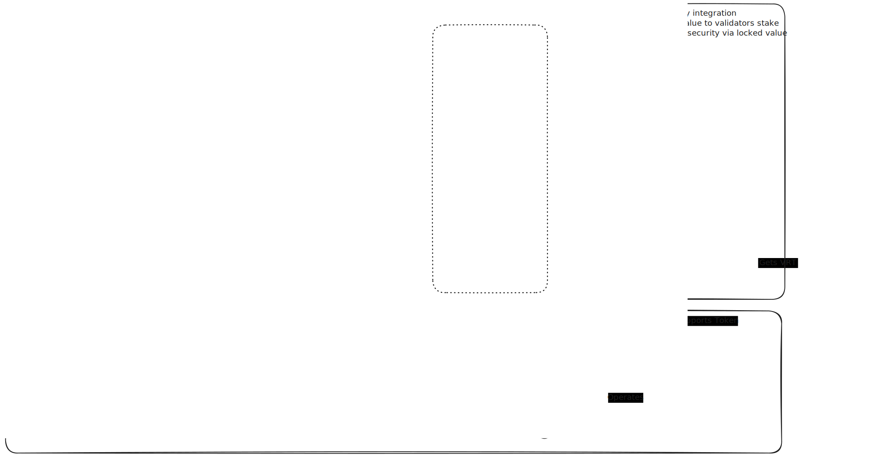

# Validator

Validators are core infrastructure services that maintain the integrity of the Ping network. They operate an L2 solution to manage the ledger and ensure proper reward distribution across the network.

## Proof Collection and Verification

Validators collect and process two primary types of cryptographic proofs:

1. **Proof-of-Contribution (PoC)** - Submitted by provider nodes
   - Nodes broadcast contribution reports that are evaluated against smart contract criteria
   - Successful validations result in Ping tokens being minted directly to node accounts

2. **Proof-of-Fraud (PoF)** - Submitted by the Ping AVS (Actively Validating Service)
   - The Ping AVS handles fraud detection until this function can be reasonably decentralized
   - AVS uses admin-signed transactions to broadcast fraud evidence to the L2 ledger

## Governance and Economic Model

Validators execute smart contracts on the L2 virtual machine that encode the reward distribution logic based on submitted proofs. They also participate in network governance through a Proof-of-Authority program, where they can submit and vote on protocol improvement proposals.

To participate as a Validator:
- Stake a minimum amount of VRT liquidity to qualify for governance rights
- Earn interest based on Ping tokenomics rules and stake amount
- Initially receive compensation for securing the L2 infrastructure
- Participate in consensus to slash funds from malicious actors when misbehavior is detected

## Network Participants and Interactions

**AVS (Ping backend)**
- Facilitates Validator discovery for nodes
- Provides data services for the web application
- Monitors the network to detect malicious activity
- Signs penalty transactions when fraud is detected

**Validator**
- Operates the L2 infrastructure that manages node account balances
- Verifies proofs and processes smart contracts
- Publishes metadata including IP address to the Solana oracle

**Node**
- Discovers available Validators through the network
- Submits signed Proof-of-Contribution to Validators for rewards
- Claims rewards from their Solana account within the L2 system

## Technology Stack

The Validator infrastructure leverages:
- **Jito Restaking** to incentivize validator liquidity staking, enhancing L2 ledger security
- **Cambrian SDK** to provide NCN operators with validator codebase, discovery mechanisms via oracle updates, and deployment tools for PoA governance and Jito-related programs