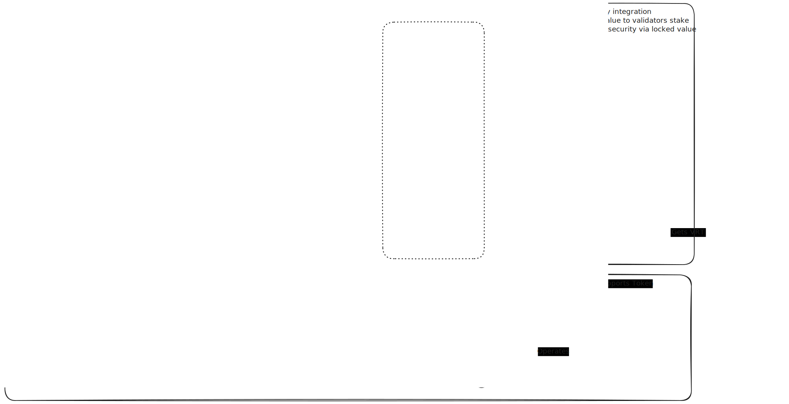

# Ping Validator - Cambrian Integration

This repository contains the implementation of the Ping Validator service integrated with the Cambrian Platform. The Ping Validator maintains network integrity, manages reward distribution through an L2 solution, and secures the Ping Protocol network.



## Project Overview

Validators are core infrastructure services in the Ping network responsible for:
- Managing the ledger on an L2 solution
- Processing proofs from network participants
- Distributing rewards according to smart contract logic
- Participating in network governance through the Jito restaking protocol

## Project Structure

```
ping-cambrian-hack/
├── assets/                 # Project assets and diagrams
├── avs/                    # AVS implementation
├── validator/              # Validator implementation 
├── frontend/               # Frontend dashboard
│   ├── app/                # Next.js app directory
│   │   ├── api/            # API routes
│   │   ├── components/     # UI components
│   │   ├── constants/      # Configuration constants
│   │   ├── hooks/          # React hooks
│   │   ├── ncn/            # NCN page
│   │   └── services/       # Service layer
│   └── public/             # Static assets
├── programs/               # Solana programs
│   └── oracle-program/     # Validator oracle program implementation
├── migrations/             # Deployment migration scripts
├── Anchor.toml             # Anchor framework configuration
├── Cargo.toml              # Rust workspace configuration
├── package.json            # Node.js dependencies and scripts
├── tsconfig.json           # TypeScript configuration
├── SCAFFOLDING.md          # Deployment logs
└── DESIGN.md               # Detailed design documentation
```

## Technology Stack

The project leverages:
- **Solana Blockchain** - For secure, high-performance transaction processing
- **Anchor Framework** - For Solana program development
- **Jito Restaking** - For incentivizing validator liquidity staking
- **Cambrian SDK** - For validator code base, discovery mechanisms, and deployment tools
- **Next.js & React** - For the frontend dashboard application
- **Tailwind CSS** - For modern, responsive styling

## Prerequisites

Before getting started, ensure you have the following installed:
- [Rust](https://www.rust-lang.org/tools/install) (1.68.0 or later)
- [Solana CLI Tools](https://docs.solanalabs.com/cli/install) (1.16.0 or later)
- [Anchor Framework](https://www.anchor-lang.com/docs/installation) (0.30.0 or later)
- [Node.js](https://nodejs.org/) (16.x or later)
- [pnpm](https://pnpm.io/installation) (8.x or later)
- [Docker](https://www.docker.com/get-started/) (For running the AVS and Validator)

## Setup and Installation

1. Clone the repository:
   ```bash
   git clone git@github.com:ping-network/cambrian-hack.git
   cd cambrian-hack
   ```

2. Install dependencies:
   ```bash
   yarn install
   ```

3. Build the Solana programs:
   ```bash
   anchor build
   ```

## Running Different Components

### Frontend Dashboard

1. Navigate to the frontend directory:
   ```bash
   cd frontend
   ```

2. Install dependencies:
   ```bash
   pnpm install
   ```

3. Start the development server:
   ```bash
   pnpm dev
   ```

4. Open your browser at http://localhost:3000

### AVS Deployment

1. Navigate to the AVS directory:
   ```bash
   cd avs
   ```

2. Deploy the AVS:
   ```bash
   camb init -t avs avs
   ```
   Follow the prompts to configure your AVS service. See SCAFFOLDING.md for configuration details.

### Validator Deployment

1. Navigate to the validator directory:
   ```bash
   cd validator
   ```

2. Deploy the validator:
   ```bash
   camb init -t operator validator
   ```
   Follow the prompts to connect to the AVS. See SCAFFOLDING.md for configuration details.

## Program Deployment Instructions

### Local Development

1. Start a local Solana validator:
   ```bash
   solana-test-validator
   ```

2. Deploy the oracle program:
   ```bash
   anchor deploy
   ```

3. Run the tests to verify deployment:
   ```bash
   anchor test
   ```

### Testnet/Devnet Deployment

1. Configure your Solana CLI to use the desired network:
   ```bash
   solana config set --url devnet  # or testnet
   ```

2. Ensure your deployment wallet is funded:
   ```bash
   solana airdrop 2  # on devnet only
   ```

3. Update the Anchor.toml file to specify the target network:
   ```toml
   [provider]
   cluster = "devnet"  # or "testnet" or "mainnet-beta"
   wallet = "~/.config/solana/id.json"  # or path to your keypair
   ```

4. Deploy the program:
   ```bash
   anchor deploy
   ```

5. Record the program ID for future reference:
   ```bash
   solana address -k target/deploy/oracle_program-keypair.json
   ```

## Recent Updates

### Jito Vault Integration

The frontend now integrates with Jito vault storage on Solana for real-time validator data:

- **NCN Page**: Displays validator information from the Solana blockchain
- **Operator Details**: Shows validator delegation and vault ticket information
- **Real-time Stats**: Displays validator stake, status, and voting metrics
- **Jito Services**: Connects directly to Solana for on-chain data retrieval

### Architecture Improvements

- **Service Layer**: Added a dedicated service for fetching validator data from Jito vault storage
- **React Hooks**: Implemented custom hooks for state management and data fetching
- **Responsive UI**: Enhanced the dashboard with loading states and error handling
- **Type Safety**: Improved TypeScript types throughout the application

## Network Participant Interactions

The Ping network has three primary participant types:

**Validator**
- Operates the L2 infrastructure for node account balances
- Verifies proofs and processes smart contracts
- Publishes metadata to the Solana oracle

**AVS (Actively Validating Service)**
- Facilitates validator discovery
- Provides web application data services
- Monitors for malicious network activity

**Node**
- Discovers validators through the network
- Submits contribution proofs for rewards
- Claims rewards from Solana accounts

## Documentation

For more detailed information:
- System design and architecture: [DESIGN.md](DESIGN.md)
- Deployment logs and configuration: [SCAFFOLDING.md](SCAFFOLDING.md)

## License

This project is licensed under the ISC License - see the LICENSE file for details.
